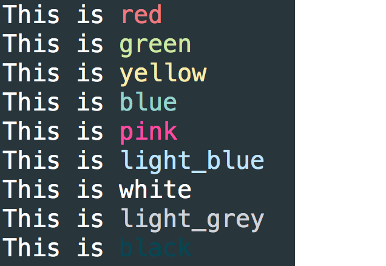

# colorizr

## Features Overview
Colorizr adds **color** to your strings.
Supported colors
  * `red`
  * `green`
  * `yellow`
  * `blue`
  * `pink`
  * `light_blue`
  * `white`
  * `light_grey`
  * `black`

## Usage Instructions
```
require 'colorizr'

puts 'John'.red
puts 'Paul'.green
puts 'George'.blue
puts 'Ringo'.yellow
```


```
p String.colors
```


```
String.sample_colors
```


## Installation Instructions
1. Download [colorizr-0.0.1.gem](colorizr-0.0.2.gem)
2. `gem install colorizr`
